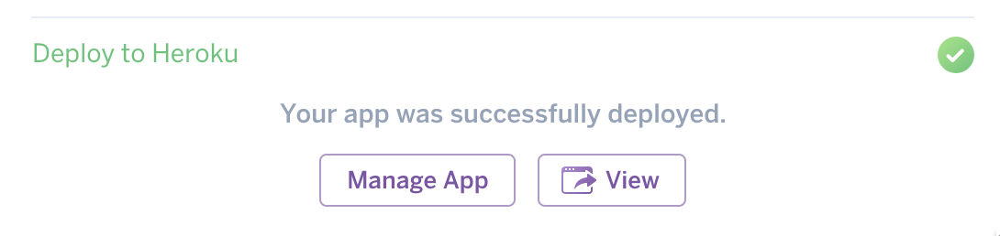
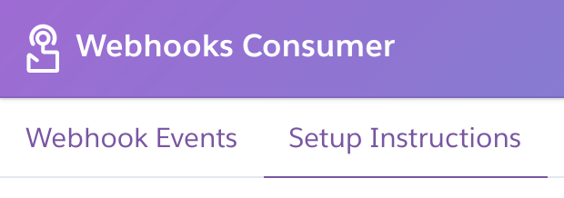

# Webhooks Consumer Demo

[](https://heroku.com/deploy?template=https://github.com/heroku/webhooks-consumer-demo)

## Online Guide

### Deploy and Launch the Application

Deploy this button and then click on the `View` link and follow the OAuth Configuration Instructions to log in.



### Follow Setup Instructions to Create Webhooks



## Offline Guide

First, deploy this button and replace `$CONSUMER_APP` in the directions with the app that was created.

### Create an OAuth Client

```
$ heroku clients:create $CONSUMER_APP https://$CONSUMER_APP.herokuapp.com/auth/heroku/callback
Creating $CONSUMER_APP... done</div>
HEROKU_OAUTH_ID=XXXXXXXX-XXXX-XXXX-XXXX-XXXXXXXXXXXX</div>
HEROKU_OAUTH_SECRET=YYYYYYYY-YYYY-YYYY-YYYY-YYYYYYYYYYYY</div>
```

### Add OAuth Client to Consumer App

```
# Add HEROKU_OAUTH_ID and HEROKU_OAUTH_SECRET to app config
$ heroku config:set HEROKU_OAUTH_ID=XXXXXXXX-XXXX-XXXX-XXXX-XXXXXXXXXXXX HEROKU_OAUTH_SECRET=YYYYYYYY-YYYY-YYYY-YYYY-YYYYYYYYYYYY -a $CONSUMER_APP
```

### Install the webhooks CLI plugin

```
$ heroku plugins:install heroku-webhooks
```

### Create an app $TRIGGER_APP that we will be triggering events on.

```
$ heroku create -n
```

### Create a release webhook

```
$ heroku webhooks:add --include api:release --url https://$CONSUMER_APP.herokuapp.com/webhooks -s "$(heroku config:get WEBHOOK_SECRET -a $CONSUMER_APP)" -l sync -a $TRIGGER_APP
```

### Trigger a release by setting a config var

```
$ heroku config:set FOO=bar -a $TRIGGER_APP
```

### Open the webhooks consumer app and log in

```
$ heroku open -a $CONSUMER_APP
```
